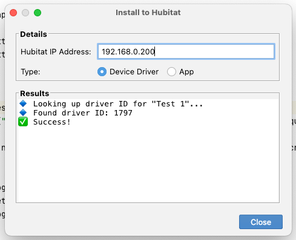
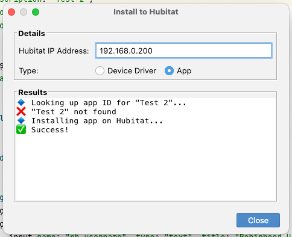
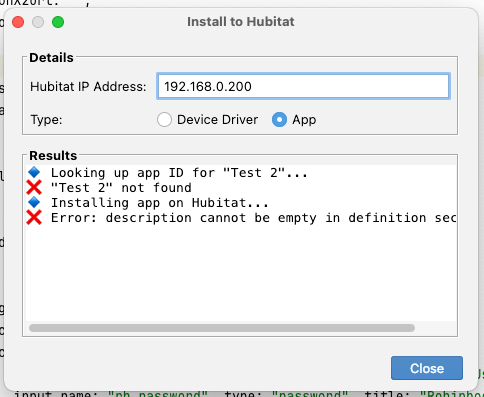
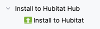

# hubitat-intellij-plugin


## An IntelliJ plugin for Hubitat app/driver developers

## Features
- Update existing app or driver on Hubitat Hub
- Install new app or driver to Hubitat Hub
- No changes to code required!

## Screenshots




## Install
- Download the latest release from Github [Releases](https://github.com/jpage4500/hubitat-intellij-plugin/releases)
- Install the plugin in IntelliJ (see [link](https://www.jetbrains.com/help/idea/managing-plugins.html#install_plugin_from_disk) for details)
- An icon should show up in the toolbar automatically after install
- IF not, add the action to your toolbar (see below)

<details>
  <summary>Add action to toolbar</summary>

- 
- If not, right-click on the toolbar -> Customize
- 
- Click Add
- 
- Search for Hubitat and click Add
- 

</details> 
 
## Usage
- Click the icon in the toolbar and hit Install

The plugin will **first** check if you have the following comments defined in your code:
```
// hubitat start
// hub: 192.168.0.200
// type: device
// id: 1782
// hubitat end
```

However, none of this is required. The plugin is designed to work without adding anything to your code.

When you run the plugin, you'll be prompted to enter the Hubitat IP and select app or device driver

- The Hubitat IP will be saved so you don't have to enter it again.
- The plugin will also remember which type you picked (app or device driver) for a given file for next time.
- If you don't have "id: 1234" defined in the code, the plugin will **lookup the ID** for you.
- If the app or driver doesn't exist, the plugin will **install** a new app/driver for you.
